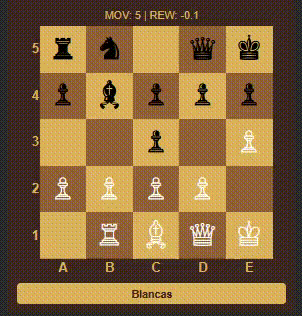

# ♟️ Gardner Chess AI: Estudio de Arquitecturas DQN (MLP vs CNN vs CNN PRO)

Este repositorio contiene un estudio experimental de **Aprendizaje por Refuerzo (Deep Q-Learning)** aplicado al **Ajedrez de Gardner**, una variante simplificada que utiliza un tablero de 5x5 para reducir la complejidad del espacio de estados. 

El objetivo principal es analizar cómo diferentes arquitecturas de redes neuronales logran capturar la intuición posicional y la táctica (basándose en la **"Estrategia B" de Claude Shannon**) en un entorno de información perfecta, sirviendo además como puerta de entrada para entender la lógica de los motores de ajedrez modernos.

---

## 🚀 Resumen del Proyecto

El agente se entrena mediante un algoritmo **DQN** con mecanismos de *Experience Replay* y *Target Networks*. Se comparan tres aproximaciones de procesamiento de estados:

* **MLP (Baseline):** Procesamiento lineal del tablero.
* **CNN Simple:** Extracción de características espaciales con filtros 2D.
* **CNN PRO:** Representación multicanal (12 planos), normalización por lotes (*Batch Norm*) y regularización (*Dropout*).

---

## 📊 Resultados y Comparativa Técnica

Tras realizar una batería de pruebas de 50 partidas por escenario, los resultados muestran una clara evolución en la capacidad de generalización del agente utilizando arquitecturas CNN frente a la basada en MLP:

| Métrica de Rendimiento | MLP (Densa) | CNN Simple | CNN PRO (Avanzada) |
| :--- | :---: | :---: | :---: |
| **Victorias vs Random (Blancas)** | 20.0% | 42.0% | 32.0% |
| **Victorias vs Random (Negras)** | 28.0% | 34.0% | 26.0% |
| **Tasa de Empates (Promedio)** | 76.0% | 62.0% | 71.0% |
| **Duelo Directo (IA vs IA)** | Baseline | Dominio Ofensivo | Superioridad Técnica (Blancas) |

### 🔍 Hallazgos Clave:

* **Superioridad Espacial:** La transición de MLP a CNN duplicó la efectividad ofensiva del agente (de un 20% a un 42%).
* **Muro de las Tablas:** El alto índice de empates (76% - 62% - 71%) revela que el agente entiende la defensa material (basada en recompensas de Shannon), pero requiere una mejora como los algoritmos de búsqueda para forzar el Jaque Mate.

---

## 🧠 Detalles de Implementación

* **Reward Shaping:** Función de recompensa densa basada en los valores materiales de Shannon (Rey=200, Reina=9, Torre=5, Alfil/Caballo=3, Peón=1) más bonus por Jaque y avance de peones.
* **Action Masking:** Filtrado de movimientos ilegales (625 posibles combinaciones) para acelerar la convergencia y evitar estados inválidos.
* **Representación Multicanal:** La arquitectura PRO utiliza un tensor de **12 planos binarios** para desacoplar la posición de cada pieza y color, eliminando las ambigüedades de los valores escalares simples.

---

## 🛠️ Tecnologías y Librerías

* **Lenguaje:** 
* **Deep Learning:** 
* **Análisis de Datos:**  
* **Entorno:** 
  
---

## 🚀 Ejecución y Uso

### Opción recomendada (Google Colab)
Haz clic en el siguiente botón para abrir el cuaderno directamente en la nube con soporte de GPU gratuito:

## 🏁 Conclusiones y Trabajo Futuro

Este proyecto valida la viabilidad de usar redes convolucionales para capturar la **"intuición" táctica** en el ajedrez. No obstante, el experimento subraya que la red neuronal es solo una parte de la solución. 

El siguiente paso lógico para alcanzar un nivel maestro es la integración de **Monte Carlo Tree Search (MCTS)**. Mientras que la red neuronal (Estrategia B) proporciona una evaluación inmediata del estado, el MCTS permite al agente realizar una "búsqueda selectiva" profunda, simulando miles de variantes antes de decidir, tal como lo hacen los modelos líderes como **AlphaZero** o la implementación híbrida de **Stockfish**.

---
**Desarrollado como estudio técnico sobre las limitaciones y potencias de DQN en entornos estratégicos.**
